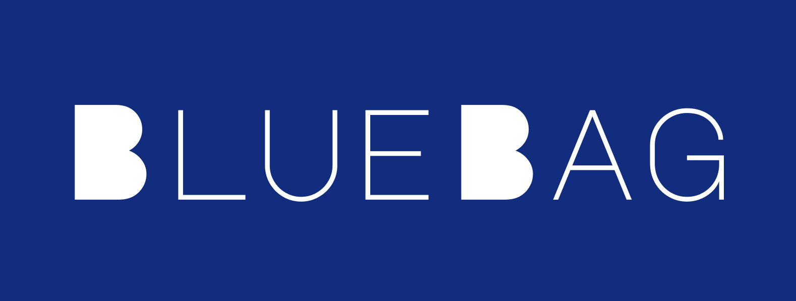

# About This Repository

This repository is inspired by Anthropic's Claude skills, but enhanced via Bluebag to work accross any LLM.

<p align="center">
  
</p>

> Bluebag gives your agents Skills, inspired by the same architecture that powers Anthropic's Claude Skills, and is the first skill infrastructure that works across all LLMs

To try out Bluebag:

- [Visit the Bluebag Playground](https://www.bluebag.ai/sdk-test)

# Skills

Skills are modular, self-contained packages that extend an AI agent's capabilities by providing specialized knowledge, workflows, and tools. Think of them as "onboarding guides" for specific domains or tasks—they transform the AI agent from a general-purpose agent into a specialized agent equipped with procedural knowledge that no model can fully possess.

For more information, check out:

- [What are skills?](https://support.claude.com/en/articles/12512176-what-are-skills)
- [Equipping agents for the real world with Agent Skills](https://anthropic.com/engineering/equipping-agents-for-the-real-world-with-agent-skills)

<br />

The repo contains example skills that demonstrate what's possible with skills system. These examples range from creative applications (art, music, design) to technical tasks (testing web apps, MCP server generation) to enterprise workflows (communications, branding, etc.).

Each skill is self-contained in its own directory with a `SKILL.md` file containing the instructions and metadata that agents use. Browse through these examples to get inspiration for your own skills or to understand different patterns and approaches.

The example skills in this repo are open source (Apache 2.0). We'll be adding more robust Skills in the coming weeks to demonstrate more complex production workflows.

**Note:** These are reference examples for inspiration and learning. They showcase general-purpose capabilities rather than organization-specific workflows or sensitive content.

# Example Skills

This repository includes a diverse collection of example skills demonstrating different capabilities:

## Creative & Design

- **algorithmic-art** - Create generative art using p5.js with seeded randomness, flow fields, and particle systems
- **canvas-design** - Design beautiful visual art in .png and .pdf formats using design philosophies
- **slack-gif-creator** - Create animated GIFs optimized for Slack's size constraints

## Development & Technical

- **artifacts-builder** - Build complex HTML artifacts using React, Tailwind CSS, and shadcn/ui components
- **mcp-server** - Guide for creating high-quality MCP servers to integrate external APIs and services
- **webapp-testing** - Test local web applications using Playwright for UI verification and debugging

## Enterprise & Communication

- **brand-guidelines** - Apply Anthropic's official brand colors and typography to artifacts
- **internal-comms** - Write internal communications like status reports, newsletters, and FAQs
- **theme-factory** - Style artifacts with 10 pre-set professional themes or generate custom themes on-the-fly

## Meta Skills

- **skill-creator** - Guide for creating effective skills that extend your agent's capabilities
- **template-skill** - A basic template to use as a starting point for new skills

<br />

# Creating a Basic Skill

Skills are simple to create - just a folder with a `SKILL.md` file containing YAML frontmatter and instructions. You can use the **template-skill** in this repository as a starting point:

```markdown
---
name: my-skill-name
description: A clear description of what this skill does and when to use it
---

# My Skill Name

[Add your instructions here that Claude will follow when this skill is active]

## Examples

- Example usage 1
- Example usage 2

## Guidelines

- Guideline 1
- Guideline 2
```

The frontmatter requires only two fields:

- `name` - A unique identifier for your skill (lowercase, hyphens for spaces)
- `description` - A complete description of what the skill does and when to use it

The markdown content below contains the instructions, examples, and guidelines that your agent will follow. For more details, see [How to create custom skills](https://support.claude.com/en/articles/12512198-creating-custom-skills).
